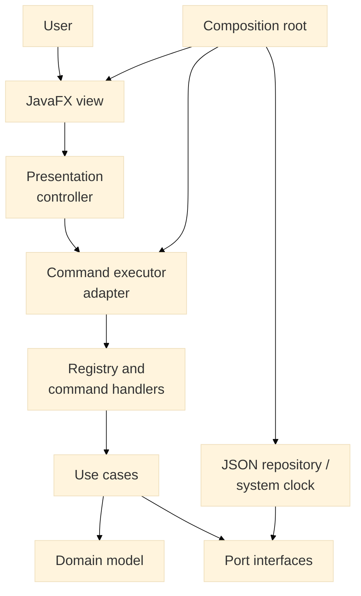
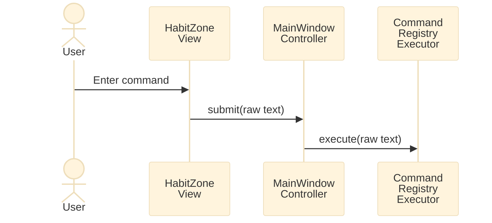
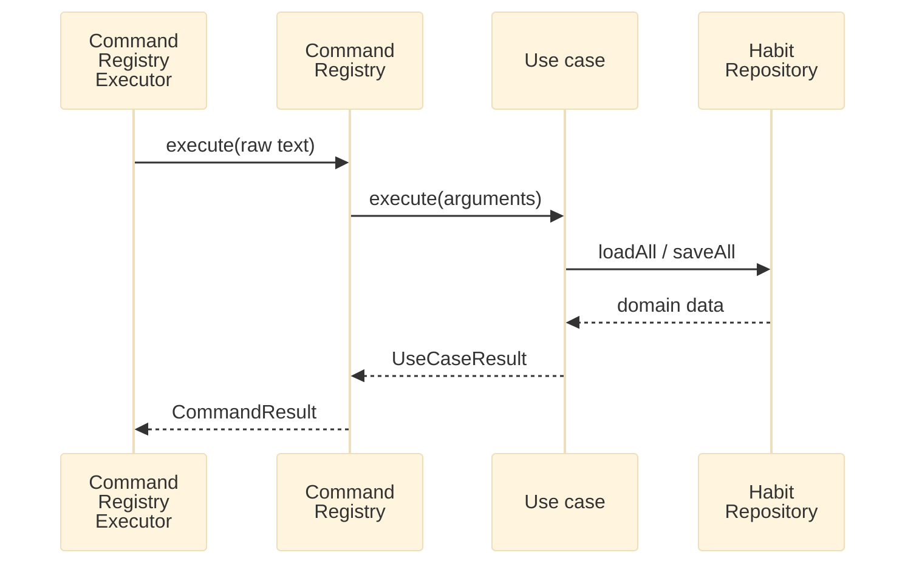
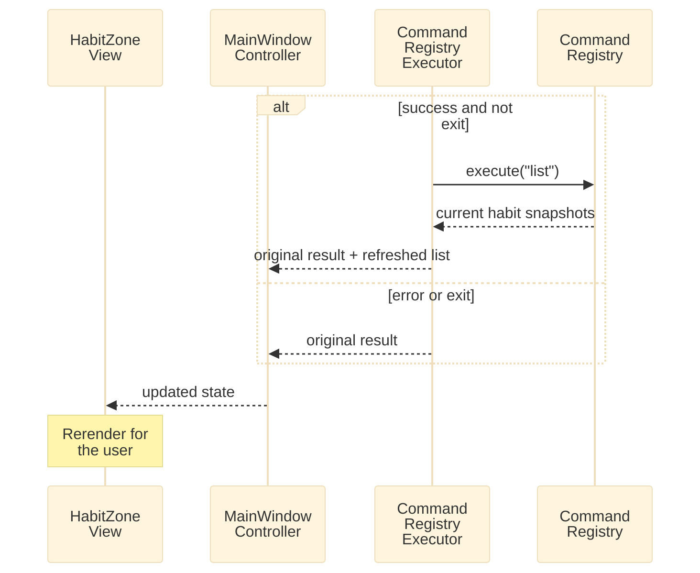

# HabitZone Developer Guide

HabitZone is a single-user JavaFX desktop habit tracker with a command-driven interface and local JSON persistence.

See the [User Guide](UserGuide.md) for user-visible behavior and command syntax.

## 1. Development setup

### Prerequisites

- JDK 25
- A graphical desktop for JavaFX and UI tests
- Internet access on the first build to obtain Gradle 9.1.0 and Maven dependencies

The repository contains the Gradle wrapper; a separate Gradle installation is unnecessary.

```powershell
# Windows
.\gradlew.bat test
.\gradlew.bat run
```

```bash
# macOS or Linux
./gradlew test
./gradlew run
```

The build uses the JDK 25 toolchain, UTF-8, Java modules, JavaFX 25.0.1, and JUnit 5.12.1. Test reports are generated at `build/reports/tests/test/index.html`.

Do not redirect `GRADLE_USER_HOME` into the repository or create project-local Gradle caches. Use the existing Gradle configuration and remove any accidental local cache.

## 2. Architecture

HabitZone uses Clean Architecture with the Command pattern at its input boundary. Dependencies point toward policy: JavaFX and JSON are outer details, while domain behavior and use cases are independently testable.



At compile time, `usecase` owns and depends on `port` abstractions, while `infrastructure` supplies implementations. This dependency inversion keeps persistence outside the application core.

### Package responsibilities

| Package | Responsibility | May depend on |
| --- | --- | --- |
| `domain` | Habit identity, state, completion invariants, optional metadata | Java standard library |
| `port` | Application-owned persistence and time boundaries | `domain` |
| `usecase` | Application actions and structured results | `domain`, `port` |
| `command` | Parse text, validate command shape, invoke use cases, format feedback | `usecase`; `infrastructure` only for `StorageException` translation |
| `infrastructure` | JSON persistence and storage error wrapping | `domain`, `port` |
| `ui` | Presentation state, JavaFX controls, navigation, command forwarding | `command`, read-only use-case DTOs, JavaFX |
| `app` | Entry points and dependency wiring | all concrete outer components |

`module-info.java` exports only `com.example.habitzone.app`; other packages are module implementation details.

### Composition root

`HabitZoneApplication.start()` constructs the object graph:

1. `JsonHabitRepository` targets `data/habits.json`.
2. `LocalDate::now` implements `ClockProvider`.
3. `CommandRegistry.withRepository()` constructs and registers use cases and commands.
4. `CommandRegistryExecutor` adapts the registry for presentation.
5. `MainWindowController` owns presentation state.
6. `HabitZoneView` renders that state and forwards interaction.

Tests replace these concrete choices with fake repositories, fixed clocks, fake executors, and injected exit actions.

## 3. Domain and use-case design

### Habit aggregate

`Habit` is the aggregate root. It contains an immutable UUID-backed `HabitId`, a trimmed non-blank immutable name, completion dates in a `TreeSet<LocalDate>`, optional expiry and category values, a priority defaulting to `NORMAL`, and an optional reminder time. New-habit validation requires at least one Unicode alphabetic letter, preventing positive integer names from conflicting with index selectors while allowing mixed names such as `Run 3 km`. The entity can still rehydrate legacy numeric names so users can load and delete data created before this rule.

The sorted set makes completion binary per date: marking twice is idempotent and unmarking an absent date is safe. It also supplies ascending persistence order and descending history order without exposing mutable state. `CompletionLog` represents one completed date.

Optional metadata is retained for forward compatibility. The UI can clear expiry but does not set or display expiry, category, priority, or reminder values. `reminderTime` is immutable after construction, so reminder commands require a deliberate domain change.

### Application results

Use cases do not expose mutable `Habit` objects:

- `HabitSnapshot` contains display-neutral state and a clock-derived `completedToday` flag.
- `HabitHistory` contains the stable habit ID, name, and completion logs in descending date order.
- `UseCaseResult<T>` contains either data or a `UseCaseError`: `DUPLICATE_HABIT`, `HABIT_NOT_FOUND`, or `INVALID_HABIT_NAME`.

Habit lookup and duplicate detection are case-insensitive while stored capitalization is preserved. Existing-habit use cases accept either a name or a positive one-based index. `HabitLookup` owns the deterministic case-insensitive alphabetical display order; both index resolution and `ViewHabitsUseCase` use it, so an index always identifies the corresponding visible row. Indices are transient and are neither domain attributes nor persisted data. `ViewHabitsUseCase` also derives today's status from the injected clock. Mutating use cases load the collection, change a domain object, and save the complete collection through `HabitRepository`.

## 4. Command and presentation design

### Dispatch

`CommandParser` trims input, lowercases only the first token, and preserves the remainder as arguments. `CommandRegistry` maps the token to a small `Command` handler. Handlers validate syntax and format responses; business decisions remain in use cases. `CommandSupport` provides ISO date parsing and translates use-case failures or `StorageException` into user-safe `CommandResult` values.

`help` derives its text from registered `usage()` values. Existing-habit usages advertise `HABIT_INDEX_OR_NAME`; positive integer arguments resolve against the current sorted list, while other text uses case-insensitive name lookup. `add` continues to accept a new `HABIT_NAME`, after which normal refresh assigns the new habit its visible position. `exit` returns a signal rather than calling JavaFX. For `done` and `undone`, the final whitespace-delimited token is a date only when it is valid ISO text or resembles a malformed date. This supports multi-word names but makes names ending in a valid date ambiguous.

### Result and refresh flow

The complete interaction is divided into three smaller sequences so that each stage remains readable.

#### 1. Submit the command



The executor then passes the request into the command and use-case layers.

#### 2. Execute the command and access storage



The executor uses that result to decide whether the displayed habit list should be refreshed.

#### 3. Refresh and render the result



Refreshing only after successful non-exit commands makes mutations immediately visible, while errors preserve the current list and calendar. A returned habit list clears the old calendar; a history result then installs the requested history. The controller invokes its injected exit action only for an exit result.

### JavaFX view

`HabitZoneView` builds the interface in Java rather than FXML. It owns the one-based number prefixed to each list cell, ephemeral de-duplicated command history, keyboard focus movement, horizontal list scrolling, panel styling, forwarding list selection as a `history` command, and rendering controller state. It contains no persistence or habit rules.

`HabitHistoryCalendar` builds Sunday-first month grids from the earliest relevant completion month to the latest, always including the current month. It highlights completed dates, provides accessible text, and initially scrolls to the current month. Calendar range, navigation, and styling stay in `ui`; only `LocalDate` values cross the inner boundary.

## 5. Persistence design

`JsonHabitRepository` implements the collection-oriented `HabitRepository`: `loadAll()` reads every habit and `saveAll()` replaces the store. This deliberately simple model suits one local user.

The default path is relative to the launch directory: `data/habits.json`. A missing directory/file is created and initialized with `[]`. The repository uses its own JSON reader/writer, so it has no JSON-library dependency. Each record has this shape:

```json
{
  "id": "f44cc342-e7f9-4e2f-8a03-61f20ad86120",
  "name": "Morning Run",
  "completionDates": ["2026-08-31", "2026-09-01"],
  "expiryDate": null,
  "category": null,
  "priority": "NORMAL",
  "reminderTime": null
}
```

Missing completion dates, optional metadata, and priority receive backward-compatible defaults. Invalid types, malformed JSON, bad dates/times/enums, and I/O failures become `StorageException`; the command boundary reports a controlled error.

Writes replace the target directly. There is currently no file lock, atomic temporary-file swap, schema version, migration mechanism, or recovery copy. Any schema change should add compatibility tests and a version/migration strategy before release.

## 6. Testing strategy

The suite follows the test pyramid and keeps unit output silent; see [TESTING.md](../TESTING.md).

| Area | Main coverage |
| --- | --- |
| `domain` | Validation, idempotence, ordering, optional fields |
| `port` | Interface contracts using simple implementations |
| `usecase` | Business flows with `FakeHabitRepository` and `FixedClockProvider` |
| `infrastructure` | JSON round trips, missing/empty files, escaping, malformed content |
| `command` | Parsing, dispatch, handlers, validation, messages, error translation |
| `ui` | Controller transitions and JavaFX rendering/navigation |

Use fixed clocks for date-sensitive assertions and temporary directories for repository tests. Prefer state assertions and descriptive test names over logs. The manual end-to-end script is [MvpAcceptanceTest.md](MvpAcceptanceTest.md); the current-release workflow is also documented in the User Guide.

Before merging, run the full suite:

```powershell
# Windows
.\gradlew.bat test
```

```bash
# macOS or Linux
./gradlew test
```

The automated suite contains 97 tests. All tests pass on the verified Windows environment.

Launch the application for changes involving JavaFX styling, focus, scrolling, calendar layout, packaging, or window behavior. UI geometry varies by platform, so tests should assert meaningful behavior rather than fragile pixel increments.

## 7. Software engineering process

### Incremental delivery

The product was developed in vertical increments documented in [PLAN.md](PLAN.md): foundation, domain, ports/use cases, storage, commands, JavaFX UI, hardening, and extension points. Each issue stated its task, success criteria, and tests; Git history records small feature commits and later feature-branch merges.

Continue using this workflow:

1. Define observable behavior and architecture constraints for one bounded change.
2. Put rules in the innermost suitable layer and keep dependencies inward.
3. Add focused tests at that layer, using ports and fakes at boundaries.
4. Wire the feature outward through command, presentation, and composition layers.
5. Run focused tests, then the full suite and relevant manual checks.
6. Update user, developer, and acceptance documentation when behavior or design changes.
7. Review the diff for unrelated files, generated output, local data, and caches.

Review changes against these principles:

- **Dependency inversion:** use cases own repository and clock abstractions.
- **Single responsibility:** rules, orchestration, parsing, storage, and rendering stay separate.
- **Explicit results:** expected failures are values; infrastructure faults are translated at the boundary.
- **Testability:** time, persistence, command execution, and exit behavior are injectable.
- **Minimal framework coupling:** the application core has no JavaFX dependency.
- **Incremental extensibility:** commands are registered handlers and optional fields have stable domain/persistence locations.

### Adding a feature

A `rename` feature, for example, should add a domain operation and invariant tests, a repository-driven use case, a command and syntax tests, registry wiring, storage compatibility checks if needed, and documentation. Add presentation tests only for new display data or interaction. Do not put rename rules in `HabitZoneView`, parse command text in a use case, or instantiate `JsonHabitRepository` inside application logic.

## 8. Known constraints and technical debt

- The whole-file store is last-writer-wins and intended for one process/user.
- Persistence is not atomic and malformed data has no automated recovery.
- The format has no schema version or migration framework.
- Habit names are immutable and cannot currently be renamed.
- Names ending in an ISO date are ambiguous for `done` and `undone`.
- Expiry, category, priority, and reminder metadata are partial extension points; most have no user-facing command.
- ControlsFX, ValidatorFX, Ikonli, and TilesFX are declared but not imported by current production source; remove them if packaging checks confirm they are unnecessary.
- Some UI behavior is platform-sensitive; the horizontal-scroll test currently fails in the verified Windows environment and needs a less fragile assertion.

## 9. Acknowledgements

The following sources and tools were reused or materially influenced this repository:

- **Clean Architecture / Hexagonal Architecture and the Command pattern:** HabitZone adapts their dependency rule, ports/adapters separation, and per-command handlers. OpenAI Codex assisted the architecture exploration and incremental plan; transcripts are retained in `logs/` and decisions are summarized in [Reflections.md](Reflections.md).
- **AI-assisted implementation and documentation:** OpenAI Codex helped propose designs, turn the selected design into issues, implement and test substantial parts of the app, and draft/update documentation. Google Gemini was used as a second reviewer for issue clarity, as recorded in `Reflections.md`. The project author reviewed and integrated generated output.
- **Application icon:** `src/main/resources/com/example/habitzone/ui/icons/habitzone-check.png` is an AI-generated green check-mark icon created with OpenAI's image-generation tool for this project, not copied from an icon set.
- **JavaFX starter project:** the initial Git commit contains an IntelliJ IDEA JavaFX starter skeleton (`HelloApplication`, `HelloController`, FXML, module descriptor, and Gradle setup). HabitZone replaced the starter UI.
- **Gradle Wrapper:** `gradlew`, `gradlew.bat`, and wrapper files are generated Gradle infrastructure. The POSIX script cites its [upstream Gradle template](https://github.com/gradle/gradle/blob/HEAD/platforms/jvm/plugins-application/src/main/resources/org/gradle/api/internal/plugins/unixStartScript.txt).
- **Open-source dependencies:** [OpenJFX](https://openjfx.io/) supplies the UI toolkit and [JUnit 5](https://junit.org/junit5/) the test framework. The build uses the [Java Modularity plugin](https://github.com/java9-modularity/gradle-modules-plugin), [OpenJFX Gradle plugin](https://github.com/openjfx/javafx-gradle-plugin), and [Badass JLink plugin](https://badass-jlink-plugin.beryx.org/releases/latest/). [ControlsFX](https://controlsfx.github.io/), [ValidatorFX](https://github.com/effad/ValidatorFX), [Ikonli](https://kordamp.org/ikonli/), and [TilesFX](https://github.com/HanSolo/tilesfx) remain declared from the starter/build configuration although current source does not use their APIs.
- **Java standard library:** the implementation uses standard UUID, date/time, collection, and NIO APIs. The JSON reader/writer is project code; no third-party JSON parser code was copied.

No other copied source, documentation, visual asset, or dataset is identified in repository history or project records for this release. Add future reuse here with its author/source, link, license where applicable, and what was adapted.
