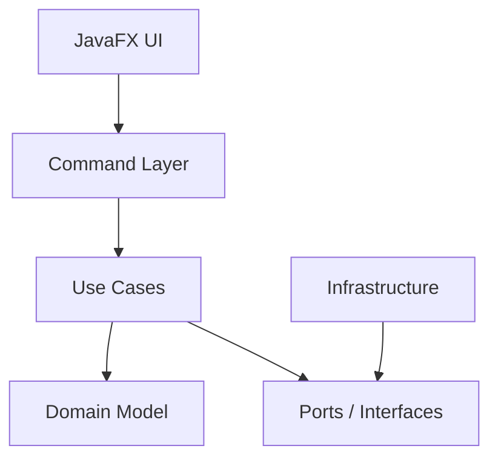

# HabitZone Incremental Development Plan

## Summary

Build HabitZone as a **JavaFX desktop app with a modern command-driven UI**, using **Clean Architecture plus a lightweight Command Pattern**.

The key rule for every phase: keep dependencies pointing inward.



The MVP should be developed incrementally so each phase leaves the app runnable, testable, and architecturally aligned.

## Architecture Rules For Every Issue

- `domain` must not depend on JavaFX, files, commands, or Gradle app classes.
- `usecase` must not depend on JavaFX or concrete storage.
- `command` converts text input into use case calls; it should not contain business rules.
- `ui` only displays state and forwards user commands.
- `infrastructure` implements ports such as `HabitRepository`, `ClockProvider`, and later `ReminderScheduler`.
- Every feature should include focused tests before moving to the next phase.

Recommended package structure:

```text
com.example.habitzone
  app
  ui
  command
  usecase
  domain
  port
  infrastructure
```

## Phase 1: Project Foundation

### Issue 1: Convert starter app into HabitZone shell

**Task**

Replace the JavaFX starter app naming and entry point with HabitZone-specific classes.

Create:

```text
app/HabitZoneApplication
app/Main
```

Keep JavaFX enabled because the MVP needs a desktop UI.

**Success Looks Like**

- Running the app opens a window titled `HabitZone`.
- No user-facing `HelloApplication`, `HelloController`, or `Hello!` text remains.
- App still launches through Gradle.
- No habit logic is implemented yet.

**Tests**

- Basic app launch smoke check if practical.
- Existing build passes.

### Issue 2: Establish package boundaries

**Task**

Create empty or minimal packages for:

```text
domain
usecase
command
port
infrastructure
ui
```

Add a short architecture note in project docs explaining dependency direction.

**Success Looks Like**

- Future agents know where code belongs.
- No business logic is placed in JavaFX controllers.
- No storage code is placed in domain/usecase classes.

**Tests**

- Build passes.

## Phase 2: Domain Core

### Issue 3: Implement core habit domain model

**Task**

Create domain types for the MVP:

```text
Habit
HabitId
CompletionLog
```

Minimum behavior:

- Habit has stable ID and name.
- Habit stores completed dates.
- Habit can mark a date complete.
- Habit can unmark a date.
- Habit can return completion history.

Use `LocalDate` for completion dates.

**Success Looks Like**

- Habit completion is binary per date.
- Marking the same date twice is idempotent.
- Unmarking a missing date is safe.
- Completion history can be returned sorted by date.

**Tests**

- Create habit.
- Mark complete.
- Mark same date twice.
- Unmark complete.
- Unmark missing date.
- History sorted ascending or descending, but choose one and keep it consistent.

### Issue 4: Add future-ready optional habit fields

**Task**

Add optional domain fields without implementing full behavior yet:

```text
expiryDate
category
priority
reminderTime
```

Create simple value types/enums where useful:

```text
HabitPriority
HabitCategory
```

Default priority can be `NORMAL`.

**Success Looks Like**

- MVP behavior does not depend on these fields.
- Fields can be persisted later.
- Future features have a clear place to attach behavior.

**Tests**

- Habit can be created without expiry/category/reminder.
- Default priority is stable.
- Existing domain tests still pass.

## Phase 3: Use Cases And Ports

### Issue 5: Define repository and clock ports

**Task**

Create interfaces:

```text
port/HabitRepository
port/ClockProvider
```

`HabitRepository` should support loading and saving all habits for the single user.

`ClockProvider` should expose current date for UI and future date-based tests.

**Success Looks Like**

- Use cases depend on interfaces, not file storage.
- Current date is not fetched directly inside use cases or UI components that need testability.

**Tests**

- Compile-time coverage through fake implementations in tests.

### Issue 6: Implement MVP use cases

**Task**

Create use cases:

```text
AddHabitUseCase
DeleteHabitUseCase
ViewHabitsUseCase
MarkHabitCompleteUseCase
UnmarkHabitCompleteUseCase
ViewHabitHistoryUseCase
```

Use cases should return structured results, not raw UI strings.

**Success Looks Like**

- Adding duplicate habit names returns a clear failure result.
- Deleting missing habits returns a clear failure result.
- Mark/unmark validates that the habit exists.
- Use cases save through `HabitRepository` after mutations.
- Use cases do not know about JavaFX or CLI formatting.

**Tests**

- Add habit.
- Reject duplicate habit.
- Delete habit.
- Reject delete missing habit.
- View empty and non-empty habit lists.
- Mark complete for valid habit/date.
- Reject mark for missing habit.
- Unmark complete.
- View history.

## Phase 4: Storage

### Issue 7: Implement JSON file repository

**Task**

Create:

```text
infrastructure/JsonHabitRepository
```

Persist all habits to a local JSON file.

Recommended file path for MVP:

```text
data/habits.json
```

The repository should create the file/folder if missing.

**Success Looks Like**

- Habits survive app restart.
- Completion history survives app restart.
- Empty/missing data file is handled gracefully.
- Invalid/corrupt JSON returns a controlled error or starts with an empty store with a visible warning, whichever policy is chosen.

**Tests**

- Save and reload habit.
- Save and reload completion dates.
- Load from missing file.
- Load from empty store.
- Do not require JavaFX for repository tests.

## Phase 5: Command Layer

### Issue 8: Implement command parser and registry

**Task**

Create:

```text
command/CommandParser
command/CommandRegistry
command/Command
command/CommandResult
```

Support MVP commands:

```text
add HABIT_NAME
delete HABIT_NAME
list
done HABIT_NAME YYYY-MM-DD
undone HABIT_NAME YYYY-MM-DD
history HABIT_NAME
help
exit
```

**Success Looks Like**

- Valid commands call the correct use case.
- Invalid commands return useful errors.
- Dates must use `YYYY-MM-DD`.
- Command output is structured enough for UI to display message, habit list, or history.

**Tests**

- Parse each valid command.
- Reject unknown command.
- Reject invalid date.
- Reject missing arguments.
- Verify command calls expected fake use case behavior.

### Issue 9: Add individual command handlers

**Task**

Create one handler per command or a similarly clean registry-based structure:

```text
AddHabitCommand
DeleteHabitCommand
ListHabitsCommand
MarkCompleteCommand
UnmarkCompleteCommand
ViewHistoryCommand
HelpCommand
ExitCommand
```

**Success Looks Like**

- Adding future commands does not require editing one large `switch` block everywhere.
- Help output lists all MVP commands.
- Command handlers contain orchestration only, not domain rules.

**Tests**

- Handler-level tests for success and failure paths.
- Help command test.
- Exit command returns an exit signal rather than closing JavaFX directly.

## Phase 6: JavaFX MVP UI

### Issue 10: Build modern command-driven main window

**Task**

Create the main JavaFX layout:

```text
Top bar: HabitZone + current date
Main area: habit list and selected habit history
Bottom area: command input
Feedback area: latest command result / error
```

The UI should look modern, but command input remains the main control surface.

**Success Looks Like**

- App opens to a polished HabitZone screen.
- User can type a command and press Enter.
- Output appears without restarting the app.
- Habit list and history panels update after relevant commands.
- Current date is visible.

**Tests**

- UI controller can be tested with fake command executor where practical.
- Manual smoke test: launch app, type `help`, see command list.

### Issue 11: Connect JavaFX UI to command layer

**Task**

Wire command input to `CommandRegistry` / command executor.

UI should:

- Send entered text to command layer.
- Display command result.
- Refresh habit list after mutations.
- Show selected habit history when available.
- Handle `exit` gracefully.

**Success Looks Like**

- User can complete the full MVP flow from UI:
  - `add exercise`
  - `done exercise 2026-08-19`
  - `history exercise`
  - `undone exercise 2026-08-19`
  - `delete exercise`
- No business rules are implemented in JavaFX controller.
- UI handles errors without crashing.

**Tests**

- Manual end-to-end smoke test through JavaFX.
- Use case and command tests remain passing.

## Phase 7: MVP Hardening

### Issue 12: Add validation and user-friendly errors

**Task**

Standardize errors for:

- Empty command
- Unknown command
- Missing habit name
- Invalid date
- Duplicate habit
- Missing habit
- Storage failure

**Success Looks Like**

- Errors are clear and consistent.
- Invalid commands do not modify data.
- UI displays errors in feedback area.

**Tests**

- Command parser validation tests.
- Use case failure tests.
- Storage failure test if feasible.

### Issue 13: Add acceptance test script/document

**Task**

Document a manual MVP acceptance flow.

Include commands:

```text
list
add reading
done reading 2026-08-19
history reading
undone reading 2026-08-19
delete reading
list
```

**Success Looks Like**

- Another agent or developer can verify the MVP quickly.
- Expected visible result is documented after each command.
- Architecture constraints are repeated briefly.

**Tests**

- Run the script manually before declaring MVP done.

## Phase 8: Future Feature Extension Points

### Issue 14: Prepare expiry feature

**Task**

Add use case and command design, not necessarily full UI polish yet:

```text
set-expiry HABIT_NAME YYYY-MM-DD
clear-expiry HABIT_NAME
```

**Success Looks Like**

- Expiry can be added without changing core command infrastructure.
- Expired habits can later be hidden, highlighted, or blocked according to product decision.

**Tests**

- Set expiry.
- Clear expiry.
- Persist expiry.

### Issue 15: Prepare priority and category features

**Task**

Add commands:

```text
set-priority HABIT_NAME low|normal|high
set-category HABIT_NAME CATEGORY
```

**Success Looks Like**

- Habit list can display priority/category.
- Storage persists both.
- Domain model remains UI-independent.

**Tests**

- Set priority.
- Reject invalid priority.
- Set category.
- Persist both.

### Issue 16: Prepare streak feature

**Task**

Add streak calculation as domain/usecase logic.

Command:

```text
streak HABIT_NAME
```

**Success Looks Like**

- Streak is calculated from completion dates.
- Current date comes from `ClockProvider`.
- Logic is testable without JavaFX.

**Tests**

- No completions gives zero streak.
- Consecutive dates calculate correctly.
- Missing day breaks streak.
- Fake clock controls current date.

### Issue 17: Prepare reminder feature

**Task**

Add reminder port:

```text
port/ReminderScheduler
```

MVP implementation can be:

```text
infrastructure/NoOpReminderScheduler
```

Later implementation can use Java scheduling APIs.

Command design:

```text
set-reminder HABIT_NAME HH:mm
clear-reminder HABIT_NAME
```

**Success Looks Like**

- Reminder data can be stored before actual desktop notifications exist.
- Real reminder scheduling can be added through infrastructure.
- Use cases depend only on `ReminderScheduler`.

**Tests**

- Set reminder time.
- Clear reminder time.
- Fake scheduler receives expected scheduling request.

## Final MVP Acceptance Criteria

The MVP is complete when:

- JavaFX app launches with modern HabitZone UI.
- User can control the app using CLI-style commands inside the UI.
- User can add, delete, list, complete, uncomplete, and view history.
- Data persists after restart.
- Current date is visible.
- Core domain/usecase/command/storage logic has unit tests.
- JavaFX controller contains no business rules.
- Future features have clear extension points through domain fields, use cases, commands, and ports.
